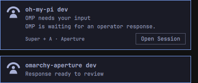
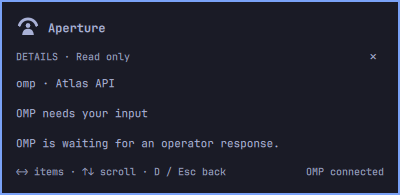
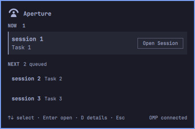

<div align="center">

# Aperture for Omarchy

**An attention panel for your OMP sessions, built into Omarchy.**

[](./manifest.json)
[](https://omarchy.org/manual/shell-plugins/)
[](https://github.com/can1357/oh-my-pi)
[](./LICENSE)


<p>Session names and concise status from supplied OMP event metadata—not full assistant responses.</p>
</div>

See what needs you, inspect the details, and jump back to the right session.

**0.1.2 is an unpublished release candidate under evaluation.**
This checkout includes authenticated signed worker **v0.8.13**, including the
reviewed worker and extension hardening. Plugin publication remains on hold
for final review. See the [release notes][release-notes].

- Follow requests for input or approval, failures, and completed work across OMP sessions.
- Keep a compact, session-first view of **NOW** and **NEXT**, with quiet **AMBIENT** context.
- Jump to the matching OMP pane in a supported terminal setup.
- Inspect details without switching windows, or hide them for privacy.

Aperture uses OMP events, not desktop notification text. It never approves
requests or answers on your behalf.

## Get started

Requirements:

- Stock Omarchy with shell-plugin support.
- OMP 18+ and Node 22+ available in the graphical session.
- For jump-to-session: Foot 1.27, Herdr 0.8.2 with one attached UI client, or
  tmux 3.7c with one attached client. See [supported focus configurations][focus]
  for details; other terminals and headless sessions are not navigable.

### 1. Install the plugin

```bash
omarchy plugin add https://github.com/tomismeta/omarchy-aperture.git --enable
```

No separate Aperture application, dependency installation, or build is needed.

### 2. Enable the included OMP extension

```bash
~/.config/omarchy/plugins/aperture/bin/omarchy-aperture-omp activate
```

**This step is required. Restart any already-open OMP sessions**, or start a new
one, to load the extension.

### 3. Add the recommended Super + A shortcut

Add this to `~/.config/hypr/bindings.lua`:

```lua
o.bind("SUPER + A", "Aperture",
  "/usr/bin/env OMARCHY_PATH=/usr/share/omarchy /usr/bin/omarchy-shell shell toggle aperture")
```

The binding is not installed automatically;
if you already use it, remove the conflicting binding or choose another key.
Reload your configuration:

```bash
hyprctl reload config-only
```

You can also click Aperture's bar mark. New installs place it on the right;
change placement in Omarchy's bar settings.

### 4. Try it

- Start a short task in a new OMP session in a supported terminal.
- When OMP reports an update, press **Super + A** to open Aperture.
- Select the item and press **Enter**, or click its row, to return to its pane.

## Using Aperture

- **NOW:** needs current attention.
- **NEXT:** queued work that can wait.
- **AMBIENT:** quiet context; no action needed.
- **Nothing needs you now:** connected sessions are calm.

The compact overview puts the session first: NOW shows a bold name above a
concise status; NEXT and AMBIENT use single-line rows. **Open Session** appears
only on the hovered or keyboard-selected row, with its space reserved so text
does not move. Row click and Enter open the exact originating OMP pane.
**Details** opens only with **D**, showing the full supplied attention text—not
the assistant's full response. Empty lanes are omitted, and the footer reports
the OMP connection status.


Controls:

- **Super + A / bar mark:** open or close.
- **↑ / ↓:** select a focusable row.
- **Enter / Open Session / row click:** open its OMP pane.
- **D:** open Details for the selected item without opening its session.
- **← / →** in Details: browse items; **↑ / ↓:** scroll.
- **P:** hide or reveal session text in the open panel and Details; no visible privacy control.
- **A:** expand or collapse Ambient.
- **D / Esc** in Details: return to the list; otherwise **Esc:** close.

Details closes if its item changes; **Enter** does not focus while in Details.
Enable **Start with details hidden** in settings for persistent privacy.
Panel privacy does not cover native OMP notification fallback.

New current attention also opens a compact notification deck without taking
keyboard focus. Each session has its own card with the full available event
title and summary. Hover a card for **Open Session** to go directly to its OMP
pane, not the overview. Hover pauses expiry. New cards append below those
already being read without moving held actions; if the viewport cannot grow
without moving them, scroll to reach the appended cards. Opening a session
removes only its card. Long bodies scroll.

**Super + A** is the recommended shortcut and the default hint shown in
notifications and the bar tooltip. If you deliberately choose another binding,
set **Open Aperture shortcut (display only)** (`openShortcut`) to match it.
The hint does not install or change a Hyprland binding.


An unseen NOW or NEXT item can start a preview, including after an earlier
popup expires. AMBIENT never starts a preview, and notifications never
auto-open the overview. Unavailable or ambiguous focus targets remain visible
but cannot be activated.

### A closer look



**Notifications:** supplied event titles and summaries, with direct navigation
to each originating session—not a transcript of the assistant's response.



**Details (D):** the full attention text supplied by an OMP event; it may be
shorter than the assistant's response.



**Privacy (P):** neutral placeholders hide rendered session text without
changing ordering or session navigation.

## Update and remove

### Update

Follow the [settings-preserving update procedure][update]: update the checkout,
shut down the worker and wait for it to exit, restart the shell, then activate
and restart existing OMP sessions. Do not deactivate for a normal update.

### Deactivate and remove

**Deactivate first; do not remove directly through the Omarchy menu.**

```bash
~/.config/omarchy/plugins/aperture/bin/omarchy-aperture-omp deactivate &&
  omarchy plugin remove aperture
```

- If deactivation fails, stop and keep the checkout; follow [recovery guidance][removal].
- Restart existing OMP sessions afterward to unload the extension.

## Troubleshooting

- **No OMP sources connected:** confirm extension activation, restart OMP,
  and run a short task.
- **An item cannot be focused:** check the [supported terminal setup][focus].
- **Worker or setup error:** inspect both statuses in the graphical session:

```bash
omarchy-shell aperture.worker status
~/.config/omarchy/plugins/aperture/bin/omarchy-aperture-omp status
```

Registration alone does not prove an existing session loaded the extension.
Missing worker IPC is expected when the plugin is disabled.
See [repair and recovery][recovery] or [report an issue with diagnostics][reporting].
Contributor documentation also tracks [screen-reader and catalog readiness][readiness].

## Why the extra setup?

- **OMP integration:** Aperture uses stock OMP’s supported ExtensionAPI—no
  modified OMP build is required. The included extension supplies structured
  attention events and exact-session focus information to the Omarchy plugin.
  Activate it separately, then restart existing OMP sessions to load it.

  OMP also publishes native events through its Warp terminal bridge, but
  Herdr 0.8.2 does not expose those events, and the bridge omits some lifecycle
  details Aperture needs. The extension remains the reliable integration
  today. See the [integration research][research] for the verified findings
  and proposed upstream improvements.

- **Removal:** stock Omarchy has no pre-remove hook for cleaning up OMP
  registration before deleting the plugin. Deactivate first so Aperture can
  remove its registration while the required files still exist.

- **Keyboard shortcut:** global bindings belong to your Hyprland configuration.
  Aperture recommends **Super + A** rather than automatically editing that file
  and potentially replacing a personal shortcut. This is a configuration
  choice, not a technical limitation.

## Relationship to Aperture

The main [Aperture repository](https://github.com/tomismeta/aperture) owns the
attention engine, SDK, CLI/TUI product, integrations, and signed worker
releases. This repository owns the Omarchy delivery channel for OMP. Installing
this plugin does not install or start the generic Aperture product runtime.

## License

[MIT](./LICENSE). Bundled components retain their licenses; see
[third-party notices](./THIRD-PARTY-NOTICES).

[focus]: https://github.com/tomismeta/omarchy-aperture/blob/main/CONTRIBUTING.md#supported-focus
[update]: https://github.com/tomismeta/omarchy-aperture/blob/main/CONTRIBUTING.md#update
[recovery]: https://github.com/tomismeta/omarchy-aperture/blob/main/CONTRIBUTING.md#restart-or-repair
[removal]: https://github.com/tomismeta/omarchy-aperture/blob/main/CONTRIBUTING.md#deactivate-and-remove
[reporting]: https://github.com/tomismeta/omarchy-aperture/blob/main/CONTRIBUTING.md#reporting-an-issue
[readiness]: https://github.com/tomismeta/omarchy-aperture/blob/main/CONTRIBUTING.md#integration-readiness
[research]: https://github.com/tomismeta/omarchy-aperture/blob/main/OMP-INTEGRATION-RESEARCH.md
[release-notes]: ./RELEASE-NOTES.md
