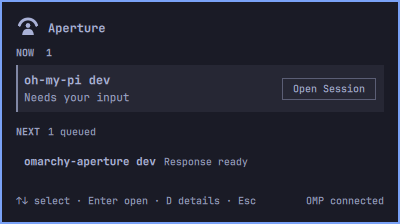

<div align="center">

# Aperture for Omarchy

**The human-attention layer for an agentic operating system.**

[](./manifest.json)
[](https://omarchy.org/manual/shell-plugins/)
[](https://github.com/can1357/oh-my-pi)
[](./LICENSE)


<p></p>
</div>

**Agent work runs in parallel. Human attention stays finite.**

Typed OMP events become a clear `NOW`, `NEXT`, and `AMBIENT` attention view,
with exact, fail-closed focus back to the right pane.

Aperture is a self-contained Omarchy plugin powered by
[Aperture](https://github.com/tomismeta/aperture). It consumes typed OMP events,
not notification text, and needs no separate Aperture service or runtime.

## Getting Started

### 1. Install the plugin

```bash
omarchy plugin add https://github.com/tomismeta/omarchy-aperture.git --enable
```

### 2. Connect OMP

Plugin installation never changes OMP configuration automatically. Activate the
authenticated extension explicitly:

```bash
~/.config/omarchy/plugins/aperture/bin/omarchy-aperture-omp activate
```

Restart any OMP sessions that were already open. New sessions load the
extension automatically.

### 3. Open Aperture

Click the Aperture mark in the bar. New installs place it in the right section.
If you want to move it:

```bash
omarchy bar move aperture --section right
```

An optional focused-monitor key binding can be added to
`~/.config/hypr/bindings.lua`:

```lua
o.bind("SUPER + A", "Aperture",
  "/usr/bin/env OMARCHY_PATH=/usr/share/omarchy /usr/bin/omarchy-shell shell toggle aperture")
```

On the stock keymap, `SUPER + A` is free.

## What You Get

- one calm view across connected OMP sessions
- `NOW`, `NEXT`, and `AMBIENT` lanes from ApertureCore judgment
- exact, fail-closed navigation back to a supported OMP pane
- a compact Omarchy-native panel that follows the active theme
- bounded replay and continuity across worker restarts
- visible privacy, compatibility, protocol, and worker failure states

The only action is **Focus OMP session**. Approve, deny, answer, and otherwise
engage inside OMP.

## The Loop

```text
+-------------+    +-------------+    +-------------------+    +-------------+
| OMP emits   | -> | Aperture    | -> | NOW / NEXT /     | -> | Focus exact |
| typed event |    | judges it   |    | AMBIENT in bar   |    | OMP pane    |
+-------------+    +-------------+    +-------------------+    +-------------+
```

If you only remember one thing, remember this:

`typed OMP events in -> one attention surface out -> exact pane focus`

## Using Aperture

| State | Meaning |
| --- | --- |
| **NOW** | Something needs current attention. |
| **NEXT** | Queued work can wait. |
| **AMBIENT** | Quiet context; no action is needed. |
| **Nothing needs you now** | Connected sessions are calm. |
| **No active OMP sessions** | The worker is ready, but no OMP source is connected. |

Panel controls:

- `↑` / `↓`: select a focusable NOW or NEXT row
- `Enter`: focus its exact registered OMP pane
- `P`: temporarily hide or reveal details while the panel is open
- `Esc`: close the panel

Unavailable or ambiguous targets remain visible but cannot be activated. A new
NOW item may reveal one bounded preview on the focused monitor; NEXT and
AMBIENT never auto-open the panel.

## Supported Focus

Focus is deliberately fail-closed:

| Backend | Supported target | Refused boundary |
| --- | --- | --- |
| Herdr 0.8.2 | Interactive OMP, one attached Herdr UI client, opaque pane ID, exact marked Foot surface | Missing or unsafe socket/pane, duplicate or lost marker, multiple UI clients |
| Foot 1.27 | Interactive OMP directly in Foot, exact one-shot terminal probe | Unknown class, missing or duplicate marker, ambiguous surface |
| tmux 3.7c | Interactive OMP pane, owned socket and pane, exactly one attached client | Detached, multiple, or nested clients; unsafe socket; missing pane; ambiguous surface |

Kitty, WezTerm, Zellij, Ghostty, Alacritty, GNU Screen/`STY`, generic xterm,
RPC/headless sessions, and unknown contexts are non-navigable.

Aperture never resumes or attaches a session, spawns a replacement terminal,
interpolates a shell command, responds to OMP, or sends ApertureCore feedback
from focus activation.

## How It Works

```text
OMP 18 typed lifecycle events
  -> signed OMP extension
  -> owner-only Unix socket
  -> signed Aperture worker + ApertureCore
  -> bounded, versioned JSONL snapshots
  -> native Quickshell service and panel
```

- `integrations/omp/aperture-omp-extension.mjs` maps allowlisted typed OMP events
  and delivers them idempotently.
- `lib/aperture-attention-engine.cjs` owns judgment, continuity, persistence,
  replay, receipts, and focus coordination.
- `Service.qml` owns one verified worker across monitors, protocol state,
  bounded queues, restart, focus requests, and teardown.
- `WorkerModel.qml` and `WorkerOutputLogic.js` accept complete, ordered worker
  snapshots.
- `Panel.qml` renders those snapshots and forwards only opaque focus handles.

The QML layer does not parse native harness payloads, rank work, deduplicate
events, change lanes, or handle approvals. Aperture is OMP-only: it does not
observe desktop notifications, notification models, or D-Bus notification
traffic.

## Requirements

- stock Omarchy plugin APIs and an unmodified `/usr/share/omarchy/shell`
- OMP 18 or newer
- Node 22 or newer from stock Omarchy's graphical-session environment
- Herdr 0.8.2, Foot 1.27, or tmux 3.7c for navigable focus

There is no runtime installer, downloader, package manager, Docker dependency,
or first-run network bootstrap.

## Privacy and Failure Behavior

Details are visible by default. Enable **Start with details hidden** to replace
titles, summaries, and source labels with neutral placeholders without changing
frame identity, ordering, or focus identity. `P` changes presentation only for
the currently open panel.

Private focus targets are volatile and are never persisted or rendered. Direct
state is bounded to 24 hours, 1,024 records, and 4 MiB. Runtime and state
directories use mode `0700`; state files and the worker socket use `0600`.

Missing payload, non-production payload, failed provenance, missing Node,
incompatible Node, malformed protocol, worker failure, no connected session,
and calm are distinct states. Configuration failures latch; unexpected worker
crashes use bounded restart backoff.

## Remove

Stock Omarchy has no plugin pre-remove hook. Disconnect OMP before removing the
plugin:

```bash
~/.config/omarchy/plugins/aperture/bin/omarchy-aperture-omp deactivate
omarchy plugin remove aperture
```

Deactivation fails closed unless it can prove the worker, socket, timers,
queued requests, OMP package link, and owned OMP settings are gone.

## Development

Clone and run the local contract suite:

```bash
git clone https://github.com/tomismeta/omarchy-aperture.git
cd omarchy-aperture
node test/run.mjs
bin/omarchy-aperture-verify-payload --require-production
```

On stock Omarchy, also run:

```bash
omarchy plugin validate .
```

Visual changes must be exercised in the real stock shell with keyboard and
pointer input. Validate relevant dark/light themes, display scales, overflow,
and multi-monitor behavior.

The vendored worker and OMP extension are authenticated upstream artifacts.
Never patch either file downstream. Make the change in
[`tomismeta/aperture`](https://github.com/tomismeta/aperture), publish a new
signed worker release, then vendor it with:

```bash
node .github/scripts/vendor-aperture-worker-release.mjs aperture-worker-v<major>.<minor>.<patch>
```

See [CONTRIBUTING.md](./CONTRIBUTING.md) for repository boundaries and change
requirements.

## Release Trust

This checkout accepts only production-eligible payloads. The current embedded
payload is the immutable, signed
[`aperture-worker-v0.7.4`](https://github.com/tomismeta/aperture/releases/tag/aperture-worker-v0.7.4)
release at Aperture commit
[`c3b5fc3`](https://github.com/tomismeta/aperture/commit/c3b5fc3a53a46c0bf937f8bac02c13bbe50d915d).

The launcher and OMP activation command both run the offline verifier before
execution. `BUILDINFO.json`, `release/release-report.json`, artifact policy,
attestations, and every payload file identity must agree.

Plugin releases use a separate fail-closed gate: an annotated signed plugin tag
must identify a commit already covered by `release-check` on protected `main`.
Publication then requires approval in the `omarchy-aperture-release` environment
and succeeds only when GitHub reports the resulting release and source tag as
immutable. Catalog publication is separate and remains manual.

## Relationship to Aperture

The main [Aperture repository](https://github.com/tomismeta/aperture) owns the
attention engine, SDK, CLI/TUI product, integrations, and signed worker
releases. This repository owns the self-contained Omarchy delivery channel for
OMP. Installing this plugin does not install or start the generic Aperture
product runtime.

## License

[MIT](./LICENSE)
